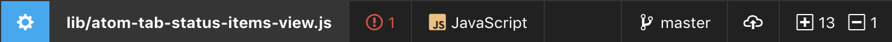

<h1 align="center">
	
</h1>

what if [powerline](https://github.com/powerline/powerline) but for [Atom](https://atom.io)

## features

it replaces the tab bar in each pane with a status bar that does:

- [vim-mode-plus](https://github.com/t9md/atom-vim-mode-plus) status
- file name and modified
- language select
- [Atom IDE](https://ide.atom.io/) diagnostics status
- git status
- auto-hide sections that don't fit
